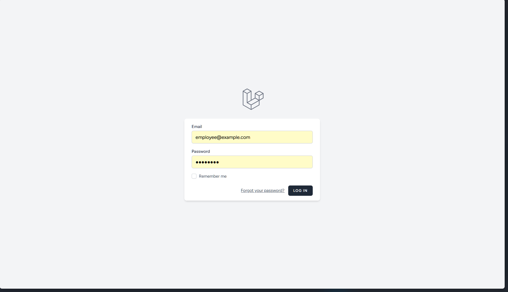
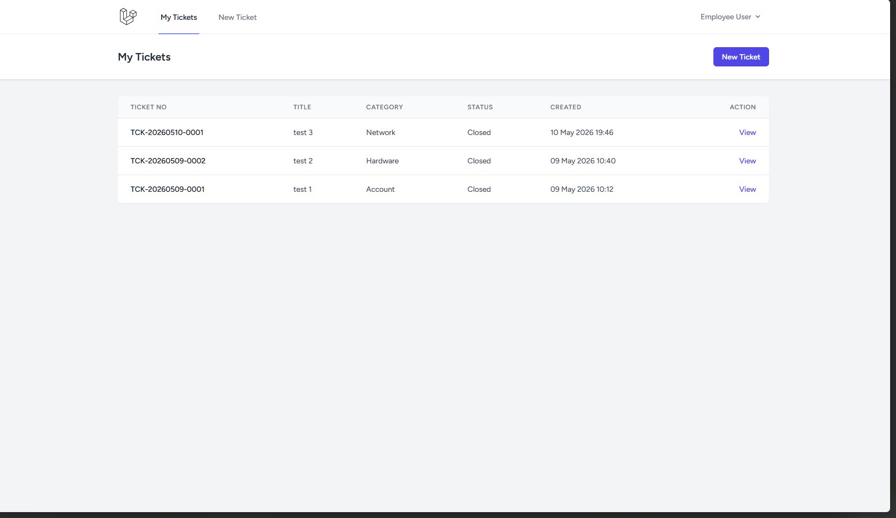
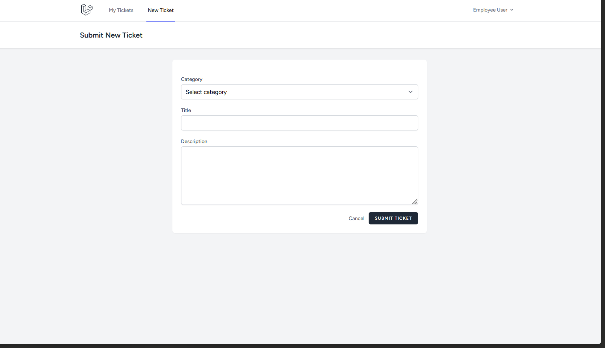
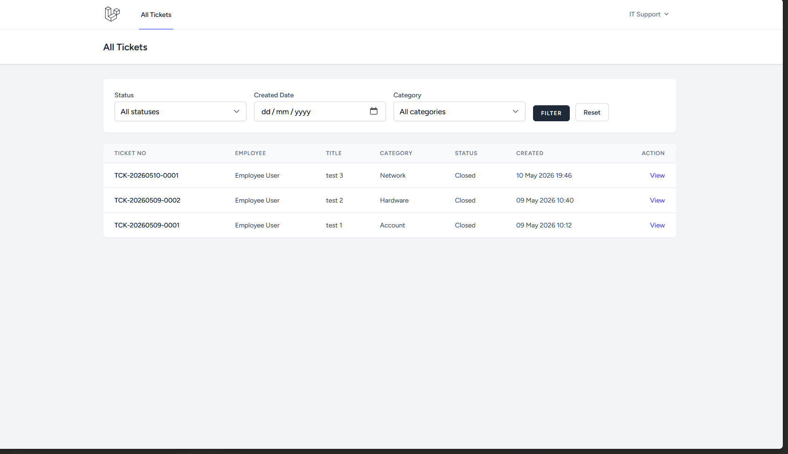
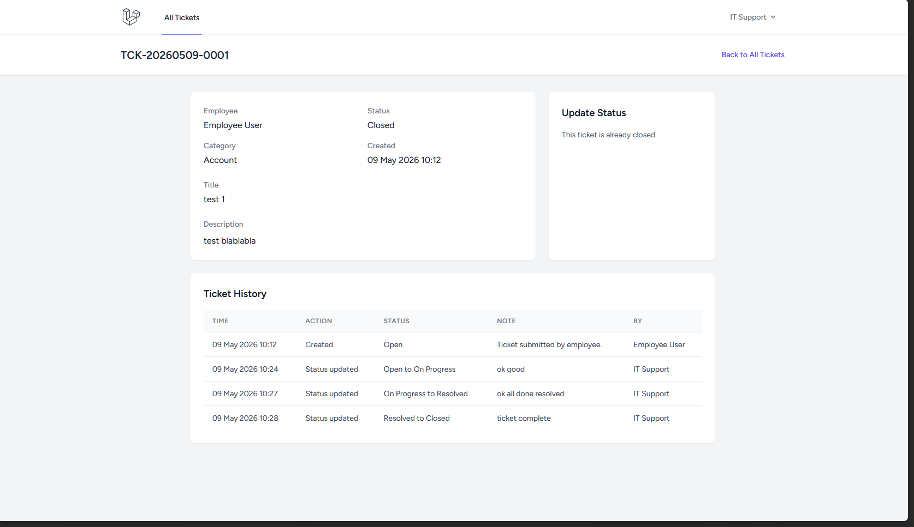

# Helpdesk Ticketing System

Website aplikasi Helpdesk Ticketing System sederhana yang dibuat menggunakan Laravel 10. 
Aplikasi ini digunakan untuk membantu karyawan mengirim request bantuan ke tim IT Support, 
lalu tim IT dapat memantau dan memperbarui status tiket tersebut.

## Fitur Utama

- Employee dapat membuat tiket bantuan baru
- Nomor tiket dibuat otomatis dan unik
- Status awal tiket otomatis menjadi `Open`
- IT Support dapat melihat semua tiket yang masuk
- IT Support dapat filter tiket berdasarkan status, tanggal dibuat, dan kategori
- IT Support dapat mengubah status tiket sesuai alur yang sudah ditentukan
- IT Support wajib mengisi note saat mengubah status tiket
- Setiap perubahan tiket dicatat di ticket history

## Tech Stack

- Laravel 10
- PHP 8
- MySQL
- Laravel Breeze
- Blade
- Tailwind CSS

## Cara Menjalankan Project

Clone repository ini:

```bash
git clone https://github.com/kaiichin/helpdesk-ticketing-system.git
cd helpdesk-ticketing-system
```

Install dependency:

```bash
composer install
npm install
```

Copy file `.env.example` menjadi `.env`:

```bash
cp .env.example .env
```

Generate application key:

```bash
php artisan key:generate
```

Atur koneksi database di file `.env`:

```env
DB_DATABASE=helpdesk_ticketing_system
DB_USERNAME=root
DB_PASSWORD=
```

Buat database MySQL dengan nama:

```text
helpdesk_ticketing_system
```

Jalankan migration dan seeder:

```bash
php artisan migrate --seed
```

Build asset dan jalankan server:

```bash
npm run build
php artisan serve
```

Buka aplikasi di browser:

```text
http://127.0.0.1:8000
```

## Akun Default

Seeder sudah menyiapkan dua akun untuk testing.

Employee:

```text
Email: employee@example.com
Password: password
```

IT Support:

```text
Email: support@example.com
Password: password
```

## Struktur Database

Project ini menggunakan empat tabel utama.

### users

Tabel ini menyimpan data akun pengguna. Di tabel ini juga ada kolom `role` untuk membedakan antara Employee dan IT Support.

Kolom penting: `id`, `name`, `email`, `password`, `role`.

### categories

Tabel ini menyimpan kategori tiket, misalnya Hardware, Software, Network, dan Account.

Kolom penting: `id`, `name`.

### tickets

Tabel ini menyimpan data utama tiket yang dibuat oleh Employee.

Kolom penting: `id`, `ticket_no`, `user_id`, `category_id`, `title`, `description`, `status`.

### ticket_histories

Tabel ini menyimpan riwayat aktivitas tiket. Setiap tiket dibuat atau statusnya diubah, data akan dicatat di tabel ini.

Kolom penting: `id`, `ticket_id`, `user_id`, `action`, `old_status`, `new_status`, `note`.

Struktur tabel history ini dibuat agar ke depannya masih mudah dikembangkan, misalnya jika ingin menambahkan log upload file.

## Relasi Database

Relasi yang digunakan di project ini:

- User memiliki banyak Ticket
- Category memiliki banyak Ticket
- Ticket dimiliki oleh User
- Ticket dimiliki oleh Category
- Ticket memiliki banyak TicketHistory
- TicketHistory dimiliki oleh Ticket
- TicketHistory dimiliki oleh User

## Alur Status Tiket

Status tiket mengikuti alur berikut:

```text
Open -> On Progress -> Resolved -> Closed
```

Saat Employee membuat tiket baru, sistem otomatis memberi status `Open`.

IT Support hanya bisa mengubah status ke tahap berikutnya. Contohnya, tiket dengan status `Open` hanya bisa diubah menjadi `On Progress`, bukan langsung ke `Resolved` atau `Closed`.

Setiap update status wajib memiliki note agar proses pengerjaan tiket tetap jelas dan bisa dilihat kembali di ticket history.

## Screenshots

Bagian ini bisa diisi dengan screenshot aplikasi.

- Login Page


- Employee Ticket List


- Create Ticket Page


- IT Support Ticket List


- Ticket Detail and History



## Cara Kerja Project

project ini bagi pengguna menjadi 2 role

Employee bisa login lalu membuat tiket baru lewat halaman New Ticket, setelah ticket dibuat sistem akan baut nomor tiket otomatis,
menyimpan status awal menjadi Open , dan mencatat aktivitas ke dalam ticket history

IT support bisa login juga untuk melihat semua tiket yang telah masuk, bisa menggunakan filter agar lebih mudah mencari tiket
berdasarkan status, tanggal, atau kategori. Bisa mengubah status tiket, dan sistem akan mengecek apakah perubahan status tersebut sesuai
dengan alur yang diperbolehkan, jika valid status tiket diperbarui dan note dari IT support disimpan ke ticket history.

Dengan cara ini, setiap tiket memiliki data utama dan riwayat perubahan yang jelas.


---
Project ini dibuat untuk technical test IT Developer Internship.
